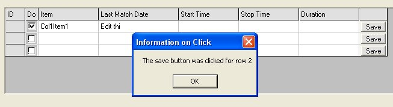



## CoolFlex2

### Description

This is just an enhancement on the existing CoolFlex from John (freevbcode.com). His code allows checkboxes, combos and textboxes to be added to a flexgrid.

For update, see

http://planet-source-code.com/vb/scripts/ShowCode.asp?txtCodeId=44962&lngWId=1
 
### More Info
 

             |
---                |---
**Submitted On**   |2003-04-22 13:54:22
**By**             |[Phred](https://github.com/Planet-Source-Code/PSCIndex/blob/master/ByAuthor/phred.md)
**Level**          |Intermediate
**User Rating**    |4.8 (29 globes from 6 users)
**Compatibility**  |VB 6\.0
**Category**       |[Custom Controls/ Forms/  Menus](https://github.com/Planet-Source-Code/PSCIndex/blob/master/ByCategory/custom-controls-forms-menus__1-4.md)
**World**          |[Visual Basic](https://github.com/Planet-Source-Code/PSCIndex/blob/master/ByWorld/visual-basic.md)
**Archive File**   |[CoolFlex21577984222003\.zip](https://github.com/Planet-Source-Code/phred-coolflex2__1-43444/archive/master.zip)

